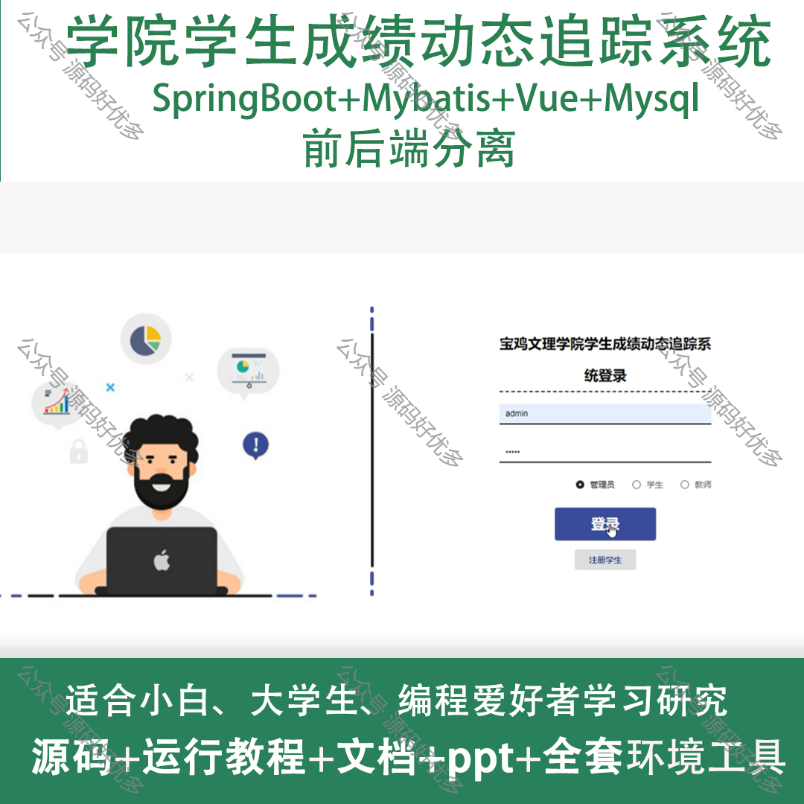
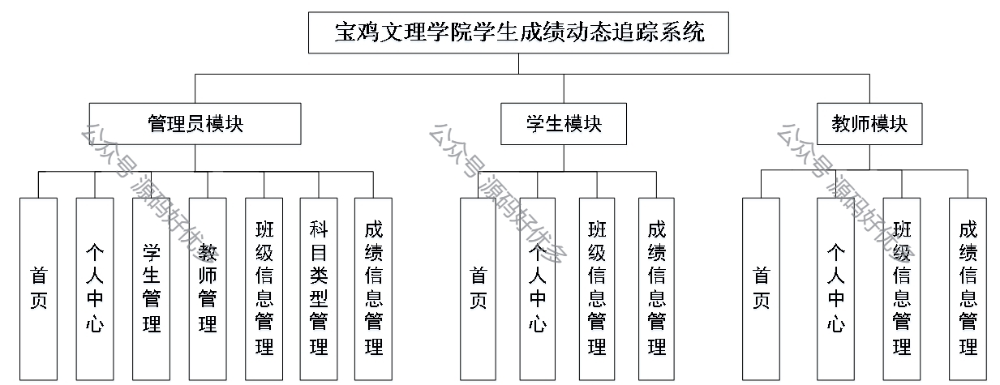
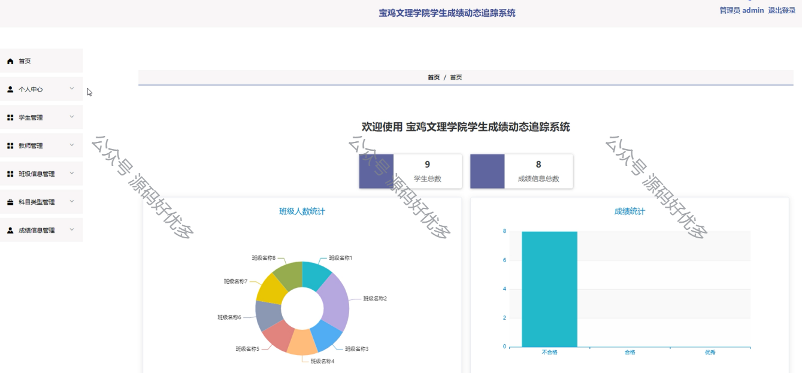
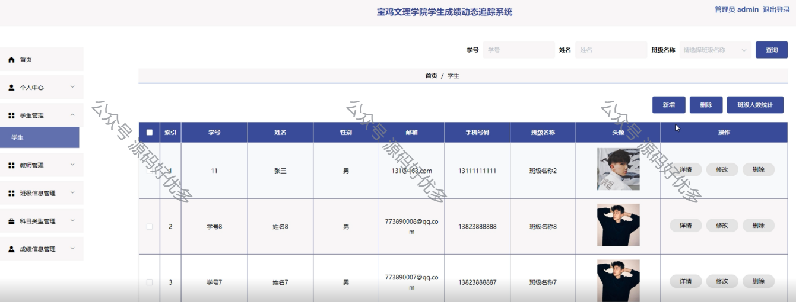
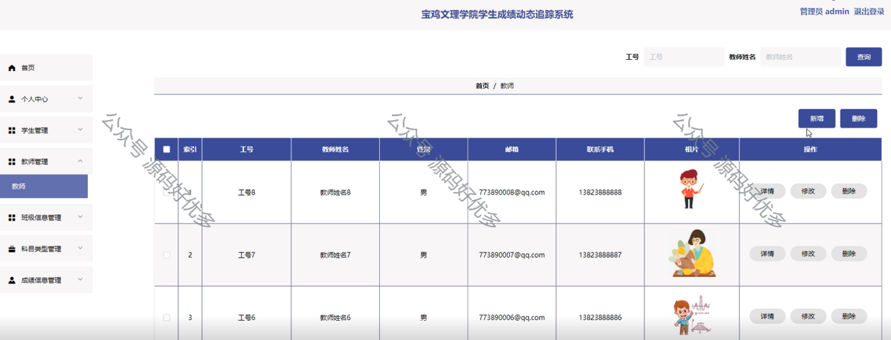
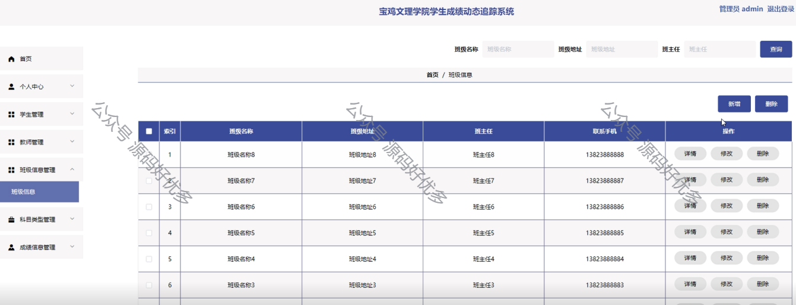
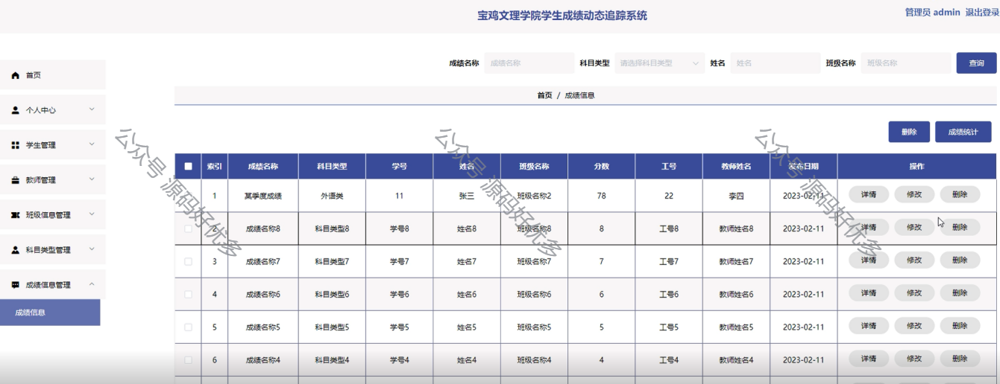
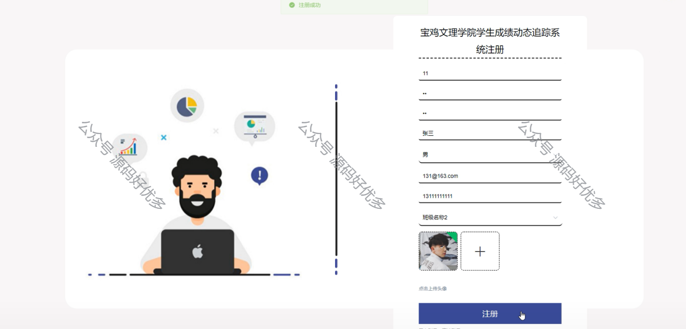
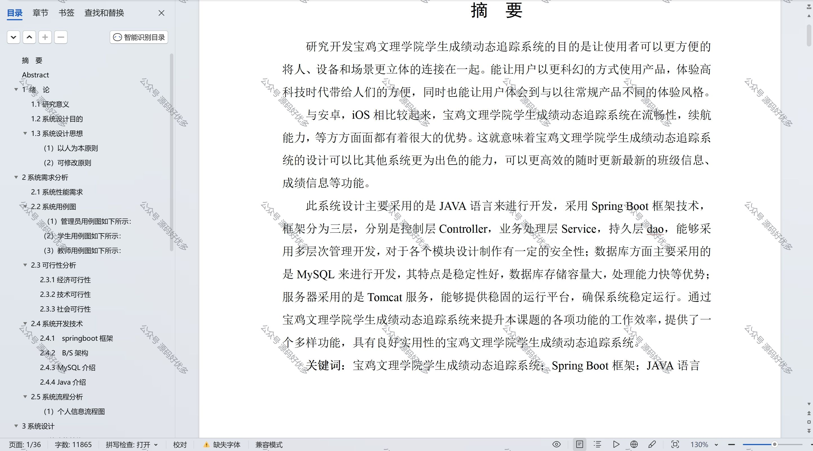

 
## 查看主页获取源码

> **作者介绍**： **✌**全网粉丝10W+本平台特邀作者、博客专家、CSDN新星计划导师、java领域优质创作者,博客之星、掘金/华为云/阿里云/InfoQ等平台优质作者、专注于项目实战 **✌**

  

### 一、作品包含

源码+数据库+设计文档万字+PPT+全套环境和工具资源+部署教程

### 二、项目技术

前端技术：Html、Css、Js、Vue、Element-ui

数据库：MySQL

后端技术：Java、Spring Boot、MyBatis

  

### 三、运行环境

开发工具：IDEA/eclipse

数据库：MySQL5.7

数据库管理工具：Navicat10以上版本

环境配置软件： JDK1.8+Maven3.6.3

前端Nodejs：14

### 四、项目介绍
项目编号：springbootA125

宝鸡文理学院学生成绩动态追踪系统旨在通过信息化手段，实时监控和记录学生的学业成绩，为教师、学生和管理人员提供便捷的成绩查询、分析和反馈平台。该系统有助于学校更好地掌握学生的学习进度和质量，及时发现学习中的问题，从而采取有效的教学干预措施，促进教育教学改革，提高教育教学质量，同时增强学生自我管理能力和学习积极性。

系统分为管理员、学生、教师
管理员的功能：首页、个人中心、学生管理、教师管理、班级信息管理、科目类型管理、成绩信息管理。
学生的功能：首页、个人中心、班级信息管理、成绩信息管理。
教师的功能：首页、个人中心、班级信息管理、成绩信息管理。

### 五、运行截图

  
